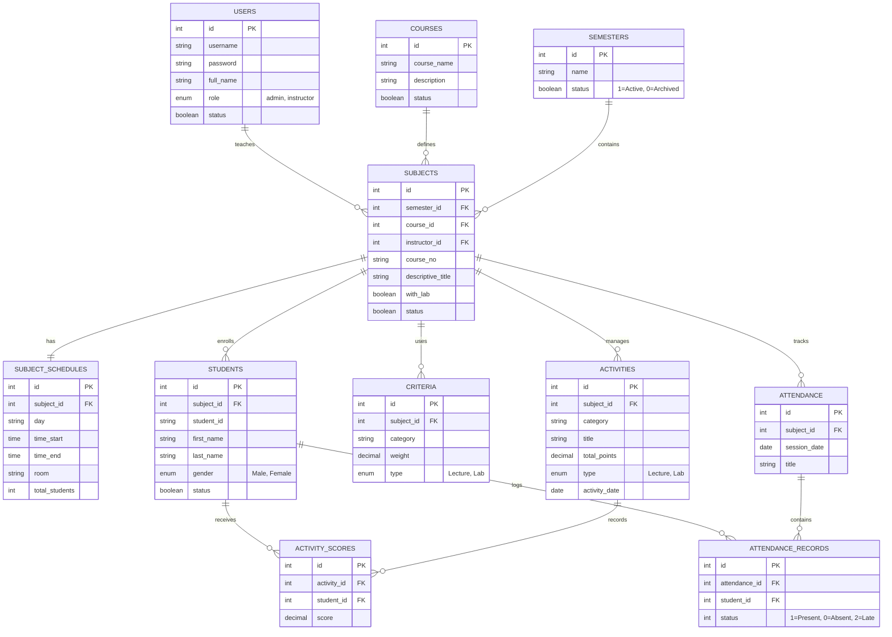

# Entity-Relationship Diagram (ERD)

This document outlines the database structure for the Student Evaluation System v2.

## Database Relationships Summary

- **Users**: Admins manage the system; Instructors are assigned to Subjects.
- **Semesters**: Provide academic cycles. A Subject is tied to a specific Semester.
- **Subjects**: The core entity. Connects a Course, an Instructor, and a Semester.
- **Students**: Enrolled per Subject. Student ID is unique within a subject but may exist across multiple subjects.
- **Criteria**: Defines how grades are weighted (e.g., Quizzes=20%, Exam=40%).
- **Activities**: Individual graded items (Quizzes, Recitation, Exams).
- **Scores & Attendance**: Link student records to specific activities and attendance sessions.
